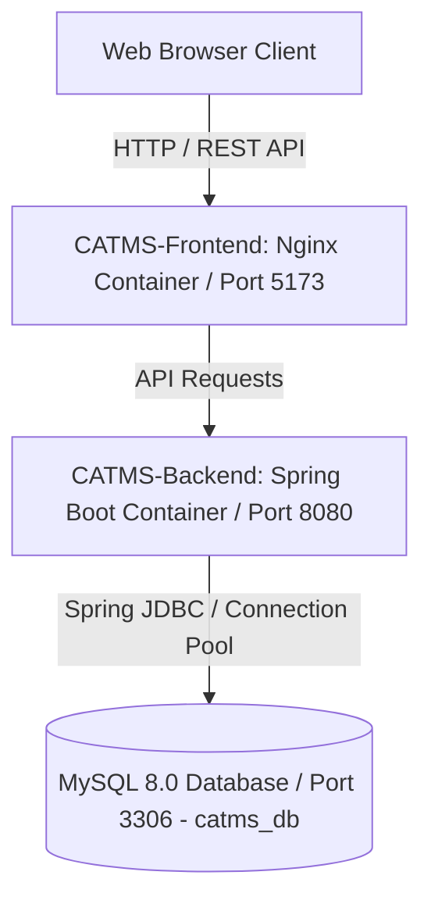

# System Architecture - MedSync / CATMS

## Architectural Overview

MedSync / CATMS follows a classic multi-tier client-server architecture composed of a React frontend client, a Spring Boot REST API backend, and a MySQL relational database engine. The system is fully containerized using Docker and Docker Compose.

---

## Component Breakdown

### 1. Presentation Layer (`CATMS-Frontend`)

- **Framework**: React 18 with Vite build tool.
- **Styling**: Tailwind CSS with responsive layout components.
- **State & Routing**: Component-level React hooks (`useState`, `useMemo`), single-page application structure.
- **Production Build**: Multi-stage Docker build utilizing `node:18-alpine` for building static assets and `nginx:alpine` for production HTTP hosting.
- **Port Mapping**: Container port 80 mapped to host port 5173.

#### Key UI Modules:
- **Navbar & Navigation**: Sticky header with brand logo, search navigation, and user authentication actions.
- **Hero & Doctor Search Bar**: Live search filtering by doctor name, specialty, or hospital affiliation.
- **Specialty Catalog**: Categorized medical specialties (Cardiology, Neurology, Pediatrics, Dermatology, Dentistry, Ophthalmology).
- **Appointment Channeling List**: Real-time listing of available doctors with rating badges, hospital affiliations, and time slots.
- **Booking Modal**: Channel confirmation dialog capturing patient information and issuing appointment confirmation.

---

### 2. Application & API Layer (`CATMS-Backend`)

- **Runtime**: Java 21 LTS.
- **Framework**: Spring Boot 3 (`spring-boot-starter-web`).
- **Data Access Layer**: Spring JDBC (`JdbcTemplate`, `NamedParameterJdbcTemplate`).
  - Chosen over heavy ORM frameworks to maintain precise control over SQL queries, stored procedure calls, transactions, and execution optimization required for the CS3043 Database Systems module.
- **Dependencies**:
  - `spring-boot-starter-web`: REST API endpoints and HTTP request handlers.
  - `spring-boot-starter-jdbc`: Relational database connection pooling and SQL execution.
  - `mysql-connector-j`: Official MySQL JDBC driver.
  - `lombok`: Boilerplate reduction for data models and DTOs.
  - `spring-boot-starter-test`: Unit and integration testing utilities.
- **Build Tool**: Apache Maven (`pom.xml`).
- **Port Mapping**: Container port 8080 mapped to host port 8080.

---

### 3. Data Storage Layer (`catms_db`)

- **Database Engine**: MySQL 8.0.
- **Database Name**: `catms_db`.
- **Port**: 3306.
- **Initialization & Schema Design**: The database structure is organized into a 10-step sequential SQL script pipeline executed from `CATMS-Backend/database/`.
  - For the complete script execution pipeline, table dependencies, and schema conventions, refer to **[Database Design & Guidelines](database_design.md)**.

---

## Containerization & DevOps Setup

The entire solution is orchestrated using Docker Compose (`compose.yaml` in `CATMS-Backend`).

### Network Topology
- **Container Network**: Custom bridge network connecting `mysql`, `backend`, and `frontend`.
- **Health Checks**: MySQL container includes `mysqladmin ping` health check to ensure database readiness before backend startup.
- **Persistence**: Named Docker volume `mysql_data` attached to `/var/lib/mysql` to ensure persistent storage across container restarts.

---

## Environment Variables

| Variable | Description | Default Value |
| :--- | :--- | :--- |
| `SPRING_DATASOURCE_URL` | JDBC Connection URL | `jdbc:mysql://mysql:3306/catms_db?useSSL=false&allowPublicKeyRetrieval=true` |
| `SPRING_DATASOURCE_USERNAME` | MySQL database user | `root` |
| `SPRING_DATASOURCE_PASSWORD` | MySQL user password | `root` |
| `MYSQL_ROOT_PASSWORD` | MySQL root password | `root` |
| `MYSQL_DATABASE` | Initial database name | `catms_db` |
| `VITE_API_BASE_URL` | API endpoint for frontend | `http://localhost:8080/api` |
