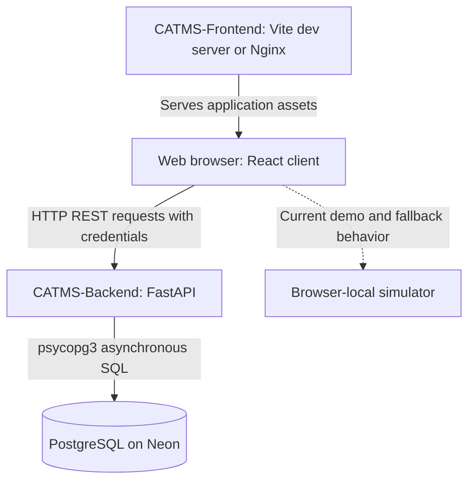

# System Architecture - MedSync / CATMS

## Architectural Overview

MedSync / CATMS follows a multi-tier client-server architecture: a React browser application, a Python FastAPI REST API, and a PostgreSQL database hosted on Neon. The current Docker Compose file starts the two application services; it does not provision PostgreSQL.

```mermaid
graph TD
    Frontend[CATMS-Frontend: Vite dev server or Nginx] -->|Serves application assets| Browser[Web browser: React client]
    Browser -->|HTTP REST requests with credentials| Backend[CATMS-Backend: FastAPI]
    Backend -->|psycopg3 asynchronous SQL| Database[(PostgreSQL on Neon)]
    Browser -.->|Current demo and fallback behavior| Local[Browser-local simulator]
```

The simulator is a separate data source, not a cache proving successful Neon operations. [Implementation & Integration Status](implementation_status.md) records the current integration boundaries.

---

## Component Breakdown

### 1. Presentation Layer (`CATMS-Frontend`)

- **Framework & Language**: React 19, TypeScript, and Vite.
- **Styling**: Application CSS and manually defined utility classes. Tailwind-style class names appear in components, but no Tailwind dependency or generation plugin is configured in the current project.
- **State & Routing**: React Router v7, centralized `AuthContext`, and `ProtectedRoute`. These control client navigation; server-side authorization remains the API's responsibility.
- **HTTP Client**: Axios with `withCredentials: true` for cookie-authenticated requests.
- **Production Build**: `node:24-alpine` compiles the assets, then `nginx:alpine` serves them. The configured build runs Vite, not a separate TypeScript check.
- **Port Mapping**: Compose maps Nginx container port 80 to host port 5173. The local Vite dev server also normally uses 5173; it is a different execution mode.

#### Key UI Modules

- **App Shell**: Shared navigation and role-specific routes.
- **Authentication**: Login/session UI and demo sessions. Public self-registration is not implemented by the backend.
- **Patients & Doctors**: Directory, detail, profile, and registration/management interfaces.
- **Appointments & Consultations**: Booking, appointment details, consultation notes, and treatment interfaces.
- **Billing & Insurance**: Invoice, payment, policy, coverage, and claim pages.
- **Branches, Staff & Reports**: Operational administration and management dashboards.

These interfaces exist in source; their presence does not establish that all corresponding real-API workflows work. The shared Axios client currently falls back to `localDb.ts` on network errors and non-authentication 404/405/501 responses.

---

### 2. Application & API Layer (`CATMS-Backend`)

- **Runtime**: Python 3.11 in the current Docker image.
- **Framework**: FastAPI with Uvicorn as the ASGI server.
- **Data Access**: Direct asynchronous SQL using `psycopg3` and `AsyncConnectionPool`, with `dict_row` results and `autocommit=True`.
  - Multi-statement mutations use explicit transactions through `database_mutation`.
  - Autocommit does not group separate statements into one transaction. Locks must be held within the relevant explicit transaction.
- **Authentication & Security**:
  - `argon2-cffi` supplies Argon2id hashing; authentication code also supports legacy bcrypt verification.
  - **PyJWT**, not `python-jose`, encodes and verifies JWTs.
  - The login route sets an HttpOnly cookie. Its Secure and SameSite behavior is configuration-dependent.
  - Protected mutation routes use CSRF verification through the `X-CSRF-Token` header.
  - The five declared roles are `admin`, `branch_manager`, `doctor`, `receptionist_cashier`, and `patient`. Record ownership and branch checks are additional controls.
- **Port Mapping**: Container port 8000; Compose exposes it on host `PORT`, default 8000.

The frontend defines a CSRF-token fetch helper but does not currently attach that header to its write requests. Identity linkage, session freshness, and the final permission matrix still require review; the existence of guards is not a complete security assessment.

#### Domain API Modules & Endpoints

All domain prefixes below are under the default `/api` prefix.

| Module | Current route families and boundaries |
| :--- | :--- |
| **Authentication & Users** | `/auth/login`, `/auth/logout`, `/auth/me`, `/auth/csrf`, and `/users`. No `/auth/register` route. |
| **Patients** | `/patients`, patient-related appointments/invoices/insurance, and nested emergency contacts. |
| **Doctors & Specialties** | `/doctors`, related resources, `/specialties`, and doctor-specialty assignments. |
| **Appointments & Notes** | `/appointments`, emergency/reschedule actions, nested notes, and `/notes/{note_id}`. Complete/cancel actions currently return 501. |
| **Treatments** | `/treatment-categories`, `/treatments`, and `/appointments/{appointment_id}/treatments`; the current schema supports one treatment assignment per appointment. |
| **Branches & Staff** | `/branches`, branch-related resources, and `/staff`. |
| **Invoices & Items** | `/invoices` and `/invoices/{invoice_id}/items`. CRUD is present; automatic generation/reconciliation is not established. |
| **Doctor Compensation** | `/invoices/{invoice_id}/payments` and `/payments/{payment_id}`. These operate on `doctor_payment`, not patient receipts. There is no `/api/billing` router. |
| **Insurance** | `/insurance/providers`, `/insurance/policies`, `/insurance/coverage`, and `/insurance/claims`. |
| **Operational Reports** | Five `/reports` routes execute SQL against base tables; they do not currently call reporting views. |

---

### 3. Data Storage Layer (`PostgreSQL` / `Neon`)

- **Cloud Hosting**: The team uses Neon for the shared PostgreSQL database.
- **Compatibility Target**: Repository SQL headers target PostgreSQL 16+. The deployed server version was not checked in this documentation review.
- **Schema & Evaluation Artifacts**: Numbered files organize tables, constraints, indexes, views, functions, procedures, triggers, seeds, and SQL checks.
- **Deployment Evidence**: Repository definitions and cloud objects must be compared separately. Placeholder files are not proof that cloud objects are absent.

Refer to [Database Design & Guidelines](database_design.md) for schema limits, artifact status, and safe synchronization.

---

## Containerization & DevOps Setup

`CATMS-Backend/compose.yaml` builds the backend and the sibling `CATMS-Frontend` repository.

### Network Topology

- **Services**: `backend` and `frontend` only. There is no `postgres` service, database volume, or database readiness health check in this Compose file.
- **Database Connection**: The backend reads its environment from `.env` and connects to the configured external database.
- **Startup**: `frontend` declares `depends_on: backend`; no health-check condition verifies API/database readiness.
- **Browser API Address**: Browser requests need a browser-reachable API URL. The Compose service name `backend` is not a public browser hostname.
- **Nginx**: The current configuration provides SPA route fallback, not an `/api` reverse proxy.
- **Frontend Configuration**: Vite reads `VITE_API_BASE_URL` at build time. The current Docker build excludes frontend `.env` and `.env.local` and exposes no build argument for that value. A hosted API address needs a deliberate build/configuration change; setting a runtime Nginx environment variable alone does not update compiled assets.

---

## Environment Variables

Never publish actual credentials or server secrets. Frontend `VITE_*` values are included in browser assets and must not contain secrets.

| Variable | Purpose / Current behavior |
| :--- | :--- |
| `DATABASE_URL` | Preferred backend connection string. Use the authorized Neon endpoint and required TLS options; never place it in frontend configuration. |
| `DB_HOST`, `DB_PORT`, `DB_NAME`, `DB_USER`, `DB_PASSWORD` | Backend fallback connection components when `DATABASE_URL` is not set. They do not create a local database. |
| `DB_POOL_MIN_SIZE`, `DB_POOL_MAX_SIZE`, `DB_POOL_TIMEOUT` | Backend connection-pool configuration. |
| `PORT` | Compose host mapping for backend port 8000; defaults to 8000. |
| `JWT_SECRET_KEY`, `CSRF_SECRET_KEY` | Backend-only signing secrets; replace development defaults before deployment. |
| `COOKIE_SECURE`, `COOKIE_SAMESITE` | Cookie transport/site policy; configure for the actual HTTPS and frontend/API deployment arrangement. |
| `FRONTEND_URLS` | Backend's comma-separated allowed CORS origins. |
| `VITE_API_BASE_URL` | Browser API base URL, including `/api`; current fallback is `http://localhost:8000/api`. |
